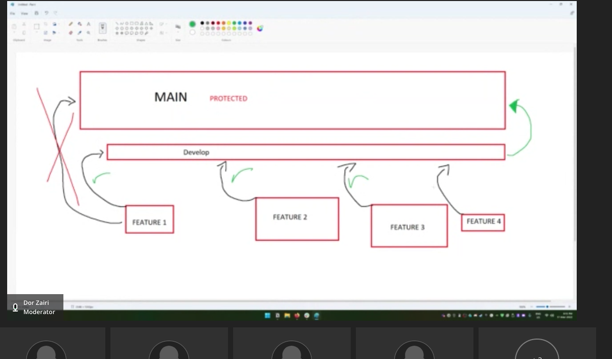

## Assignment Content

```
This group assignment is to gain experience
 and work with other parties; I have already set up groups.
```

```
You will have to do a project that all the parties agree on.
After that, you will have to manage 1 person to be the GitHub responsible
that the repo will be on his user
(don’t worry if you want the repo to be also in your user fork it).
```

```
The assessment should be consistent with 50 commits and at least 10 merges, the project itself should be legitimate, a website that you are creating or any project that involves code that you see fit as well you will need to make the main branch protected and create a develop branch, that is the only one branch that can be merged into main, all the feature branches should be merge into the develop branch


You will have two weeks to complete the assignment.

```

## what do you need to do to complete the assignment -

```
1. Manage one of the teammates to be GitHub responsible
2. Agree on a project that you all want to make
3. Make the Main branch and protect it from directly pushing commits into it.
5. Make a Develop branch and merge into it the feature branches.
5. Make 1 person review the merge condition; merge can’t confirm the merge.
 5a. Another teammate needs to approve it.
5b. achieve 50 commits (can include the merge commits)
5c. achieve 10 merges
```

```
I will be checking for who committed. I want to make sure everyone pulls their weight on the assignment, and the team carries no one.
```

### Project diagram


